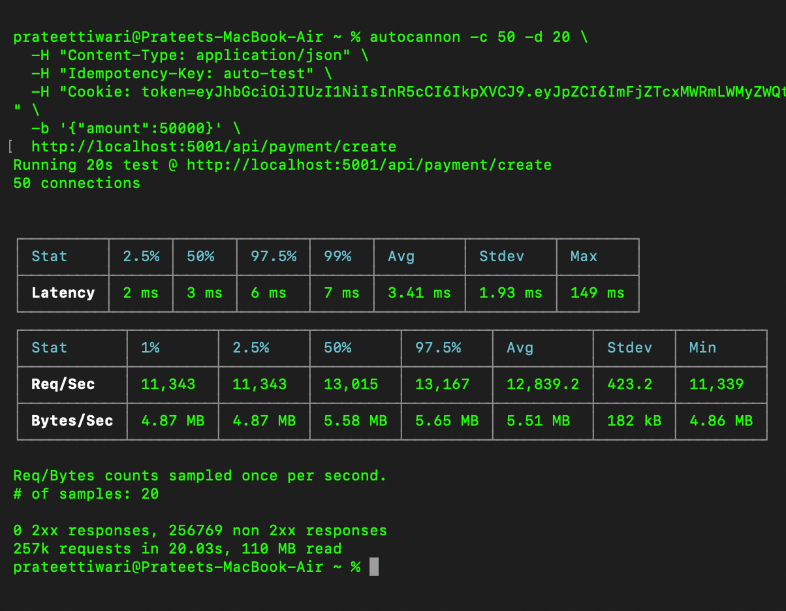
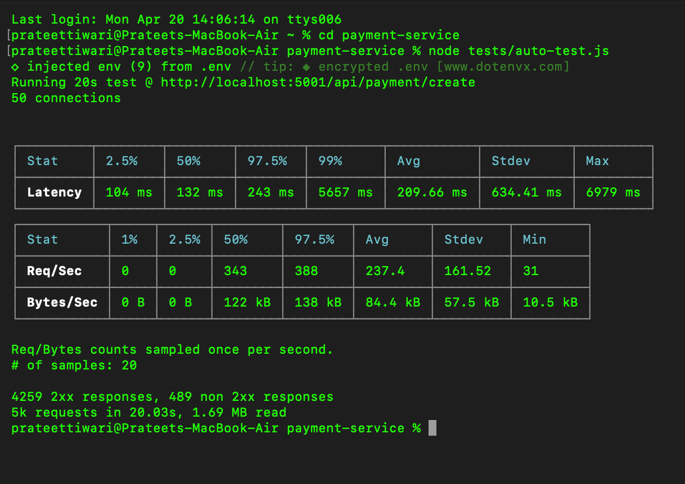

# Payment Service

Built a fault-tolerant payment system using Stripe, designed for exactly-once execution under high concurrency. Implements idempotent APIs, race-condition-safe processing, and an asynchronous worker system (BullMQ) with retries and DLQ for reliable payment handling.

---

## Load Testing

Validated system under concurrency and real load conditions:

- ~50 concurrent users
- ~5k requests, ~237 req/sec (end-to-end flow)
- ~12k req/sec idempotency fast-path (~3ms rejection latency)
- Zero duplicate transactions

  

---

## Architecture Highlights

- Cookie-based authentication (JWT)
- Stripe PaymentIntent integration
- Webhook-based payment confirmation (source of truth)
- Idempotent APIs (prevents duplicate execution)
- Race-condition safe processing
- Asynchronous processing via BullMQ workers (Redis)
- Retry mechanism with exponential backoff
- Dead Letter Queue (DLQ) for failed jobs

---

## Flow

1. Create Order → Generate PaymentIntent
2. Client confirms payment
3. Stripe sends webhook
4. Webhook enqueues job
5. Worker processes payment (success/failure)
6. Order + Payment updated in DB

---

## Tech Stack

- Node.js
- Prisma + PostgreSQL
- Stripe
- BullMQ + Redis
